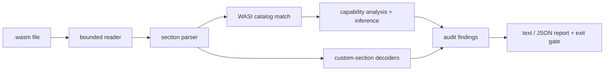

# wasmscout

[English](README.md) | [中文](README.zh.md) | [日本語](README.ja.md)

[](LICENSE) [](Cargo.toml) [](CHANGELOG.md)  [](CONTRIBUTING.md)

**wasmscout：WebAssembly バイナリのケイパビリティを監査するオープンソースツール——imports、WASI ケイパビリティ、カスタムセクション、サイズを解析し、実行する前に「このモジュールは何に触れられるのか」を明らかにする。**


```bash
git clone https://github.com/JaydenCJ/wasmscout.git && cargo install --path wasmscout
```

> プレリリース：v0.1.0 はまだ crates.io に公開されていません。上記の通りソースからビルドしてください（Rust ≥1.75、依存ゼロ）。

## なぜ wasmscout？

いまや第三者のコードは wasm プラグインとして agent・プロキシ・データベース・エッジ基盤に入り込みます——そしてこれから読み込むモジュールは、誰かに渡された不透明なバイナリです。既存ツールはそれを*記述する*だけ：`wasm-objdump` と `wasm-tools print` は各セクションを忠実にダンプし、`twiggy` はサイズを分析しますが、運用者の本当の問い——*こいつはファイルを書けるのか？ソケットを開けるのか？環境変数を読めるのか？*——にはどれも答えず、受け入れパイプラインに組み込める合否シグナルも出しません。wasmscout はダンパーではなく監査器です：依存ゼロ・実行ゼロでバイナリを解析し、各関数 import を完全な 46 関数の WASI preview 1 カタログ（加えて preview 2 インターフェース接頭辞とカスタムホストモジュール）を通じてリスク別 11 ケイパビリティグループへ写像し、来歴と漏洩を運ぶカスタムセクションをデコードし、結果を重大度つきの安定した finding id・JSON レポート・終了コードに変えます。import 一覧が隠す組み合わせすら捕まえます：`path_open` + `fd_write` はファイル書き込み能力であり、`path_unlink` など要らないのです。

|  | wasmscout | wasm-objdump (wabt) | wasm-tools print | twiggy |
|---|---|---|---|---|
| 印字でなく判定する | ✅ ケイパビリティグループ + findings | ❌ セクションをダンプ | ❌ テキスト形式をダンプ | ❌ サイズ分析 |
| WASI import → ケイパビリティ写像 | ✅ preview 1 全 46 関数 + preview 2 接頭辞 | ❌ | ❌ | ❌ |
| 組み合わせ推論（`path_open`+`fd_write`） | ✅ `[inferred]` 表示 | ❌ | ❌ | ❌ |
| CI ゲート：重大度・拒否リスト・終了コード | ✅ `--fail-on` / `--deny` / `--ignore` | ❌ | ❌ | ❌ |
| 切断・偽装ファイルの診断 | ✅ バイトオフセット、HTML/ELF/wat 判別 | 部分的 | 部分的 | ❌ |
| デバッグ肥大と source-map 漏洩の検査 | ✅ サイズ、割合、漏れた URL | ❌ | ❌ | 部分的 |
| 実行時依存 | 0——静的バイナリ 1 個 | C++ ツールチェーン | Rust クレート群 | Rust クレート群 |

## 特徴

- **「このモジュールは何に触れられる？」がコマンド一発**——各関数 import は 11 のケイパビリティグループ（`fs-write`、`network`、`host`、`fs-read`、`environment`……）のいずれかに写像され、リスク順に並び、どの import がそれを与えたかを逐一列挙します。
- **組み合わせを理解する**——`path_open` の権利は呼び出し時に決まるため、`path_open` + `fd_write` は `fs-write` として `[inferred]` 表示つきで報告され、理由もメッセージに書かれます。import 一覧を眺めるだけでは絶対に見つかりません。
- **誠実な分類**——単独の `fd_write` は stdio（`fd-io`、低リスク）であり「ファイルシステム書き込み」ではありません。大げさな報告は無視を学習させるだけなので、低リスクのケイパビリティは表には出ても finding にはなりません。
- **カスタムセクションはスキップせずデコード**——`producers` のツールチェーン来歴、ファイル比で示すデバッグ肥大、`sourceMappingURL` が漏らす URL、リンカを逃れた `linking`/`reloc.*` オブジェクトファイル、`dylink` のローダ前提。
- **レポートでなく CI ゲート**——重大度つき 17 の安定 finding id、`--fail-on high|medium|low|info|never`、ケイパビリティの存在で判定する `--deny network,fs-write`、finding id 単位の `--ignore`、終了コード `0`/`1`/`2`、JSON Lines 出力。
- **依存ゼロ・通信ゼロ・実行ゼロ**——純粋な `std` Rust の静的バイナリ 1 個。ローカルファイルを読み stdout に書くだけで、モジュールのバイトは 1 つも実行しません。
- **敵対的入力に強い**——切断はバイトオフセットつきで報告、ありえないベクタ数は拒否、過長 LEB128 も拒否、HTML/ELF/gzip/`.wat` の偽装は名指しで識別。post-MVP の内容（GC 型、未知セクション）はクラッシュせず品位ある縮退をします。

## クイックスタート

インストール（Rust 1.75+ が必要）：

```bash
git clone https://github.com/JaydenCJ/wasmscout.git && cargo install --path wasmscout
```

リポジトリ内蔵の決定的 writer でデモ fixtures を生成し、import 一覧が無害に見えるモジュールを監査します：

```bash
cd wasmscout && cargo run --example gen_fixtures -- /tmp/wasm-fixtures
cd /tmp/wasm-fixtures && wasmscout scan sneaky-logger.wasm
```

出力（そのまま取得）：

```text
sneaky-logger.wasm: core wasm module · 187 B · 5 section(s) · 4 import(s) · 1 export(s)
  target: WASI preview 1 (wasi_snapshot_preview1)

capabilities
  fs-write     high    path_open, fd_write [inferred]
  fs-read      medium  path_open
  fd-io        low     fd_write, fd_close
  clocks       low     clock_time_get

findings
  high[wasi.fs-write]: file-write capability inferred from path_open, fd_write: path_open chooses rights at call time; combined with fd_write the module can write any file it can open
  medium[wasi.fs-read]: imports 1 file-reading WASI function(s) (path_open) — the module can open and read everything under the runtime's preopens

summary: 1 module(s) scanned — 1 high, 1 medium, 0 low, 0 info · gate: fail-on high → FAIL
```

終了コードは 1。受け入れパイプラインはこの場でモジュールを拒否します。純計算モジュールなら最も厳しいポリシーさえ通過します：

```bash
wasmscout scan --fail-on info --deny network,fs-write image-filter.wasm
```

```text
image-filter.wasm: core wasm module · 201 B · 8 section(s) · 0 import(s) · 2 export(s)
  module name: "image_filter"
  producers: language Rust 1.75.0 · processed-by rustc 1.75.0, wasm-opt 116
  target: no function imports (pure compute module)

capabilities
  (none — the module cannot touch the host at all)

findings
  (none)

summary: 1 module(s) scanned — 0 high, 0 medium, 0 low, 0 info · gate: fail-on info → PASS
```

`wasmscout caps *.wasm` は一斉点検向けにモジュールごと 1 行のリスク順リストを出力。`imports`・`exports`・`sections` はシグネチャ、limits、サイズ内訳を表示し、`--format json` はモジュールごとに機械可読オブジェクトを 1 つ出します。`examples/ci-gate.sh` は完全なプラグイン受け入れゲートです。

## ケイパビリティとリスク

11 のケイパビリティグループをリスク別に格付け。完全な写像（preview 1 全 46 関数、preview 2 接頭辞、推論規則、全 finding id）は [docs/capabilities.md](docs/capabilities.md) に記載しています。

| ケイパビリティ | リスク | 与えるもの |
|---|---|---|
| `fs-write` | high | ランタイムの preopens 配下でファイルの作成・変更・削除 |
| `network` | high | ホスト提供ソケットでの accept・送信・受信 |
| `host` | medium | カスタムホスト関数——威力は埋め込み側次第 |
| `fs-read` | medium | パスを開き、ファイルとディレクトリ一覧を読む |
| `environment` | medium | ホストの環境変数を読む |
| `fd-io` / `args` / `clocks` / `random` / `process` / `scheduling` | low | stdio、argv、時計、乱数、exit、poll |

## CLI オプション

| Key | 既定値 | 効果 |
|---|---|---|
| `--format` | `text` | `json` はモジュールごとに 1 オブジェクト（JSON Lines）を出力。ケイパビリティ・findings・`pass` を含む |
| `--fail-on` | `high` | この重大度以上で終了コード 1：`high`、`medium`、`low`、`info`、`never` |
| `--deny` | なし | カンマ区切りのケイパビリティ。存在するだけで終了コード 1。カタログと照合して検証 |
| `--ignore` | なし | カンマ区切りの抑制する finding id。カタログと照合して検証 |

終了コード：`0` = ゲート通過、`1` = ゲートに掛かった finding または拒否ケイパビリティあり、`2` = 使い方の誤り、読めない/壊れた入力、または component-model バイナリ（検出はするが監査は未対応）。

## 検証

このリポジトリは CI を持ちません。上記の主張はすべてローカル実行で検証されています：`cargo test`（ユニット 77 + CLI 統合 13）と `bash scripts/smoke.sh`——実物の wasm fixtures を生成しバイナリをエンドツーエンドで駆動し、必ず `SMOKE OK` を印字します。

## アーキテクチャ



## ロードマップ

- [x] コア監査器：敵対的入力ガードつき std 専用バイナリパーサ、46 関数の WASI preview 1 カタログ + preview 2 接頭辞、ケイパビリティ推論、17 の finding id、JSON 出力、deny/fail-on/ignore CI ゲート、決定的 fixture writer、テスト 90 件 + smoke スクリプト
- [ ] Component-model（layer 1）監査：world とインポートされるインターフェース
- [ ] シグネチャ適合：preview 1 imports を仕様の型と照合
- [ ] `wasmscout pin`：モジュールのケイパビリティ集合をロックファイルに固定し、更新で広がったら CI を落とす
- [ ] コールグラフ到達性：どの export がどのケイパビリティへ実際に到達できるか
- [ ] コードスキャン UI 向け SARIF 出力

完全なリストは [open issues](https://github.com/JaydenCJ/wasmscout/issues) を参照してください。

## コントリビュート

コントリビュート歓迎——[CONTRIBUTING.md](CONTRIBUTING.md) を参照のうえ、[good first issue](https://github.com/JaydenCJ/wasmscout/issues?q=is%3Aissue+is%3Aopen+label%3A%22good+first+issue%22) から始めるか、[discussion](https://github.com/JaydenCJ/wasmscout/discussions) を立ててください。

## ライセンス

[MIT](LICENSE)
