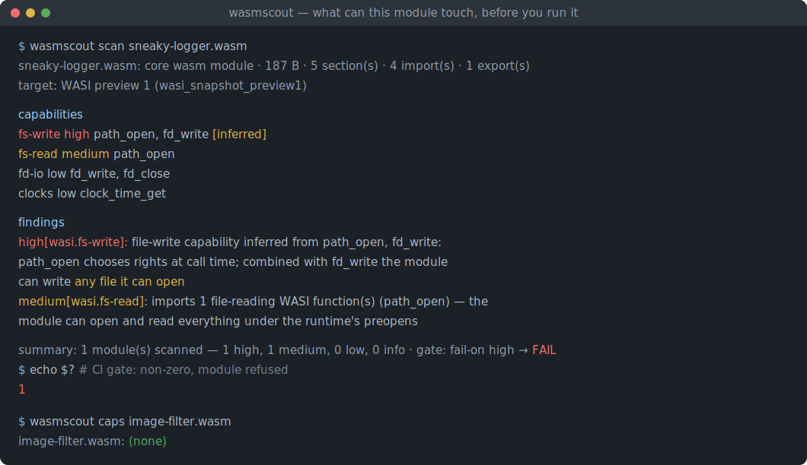
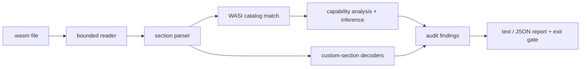

# wasmscout

[English](README.md) | [中文](README.zh.md) | [日本語](README.ja.md)

[](LICENSE) [](Cargo.toml) [](CHANGELOG.md)  [](CONTRIBUTING.md)

**wasmscout：an open-source capability auditor for WebAssembly binaries — imports, WASI capabilities, custom sections and size, so you know what a module can touch before you run it.**



```bash
git clone https://github.com/JaydenCJ/wasmscout.git && cargo install --path wasmscout
```

> Pre-release: v0.1.0 is not on crates.io yet; build from source as above (any Rust ≥1.75, zero dependencies).

## Why wasmscout?

Wasm plugins are how third-party code gets into agents, proxies, databases and edge platforms now — and the module you are about to load is an opaque binary someone handed you. The existing tooling *describes* it: `wasm-objdump` and `wasm-tools print` dump every section faithfully, and `twiggy` profiles size, but none of them answers the operator's actual question — *can this thing write files? open sockets? read my environment?* — and none gives you a pass/fail signal to wire into an intake pipeline. wasmscout is an auditor, not a dumper: it parses the binary with zero dependencies and zero execution, maps every function import through the complete 46-function WASI preview 1 catalog (plus preview 2 interface prefixes and custom host modules) into 11 risk-ranked capability groups, decodes the custom sections that carry provenance and leaks, and turns the result into stable finding ids with severities, a JSON report and exit codes. It even catches the combination the import list hides: `path_open` + `fd_write` is file-write capability, no `path_unlink` required.

|  | wasmscout | wasm-objdump (wabt) | wasm-tools print | twiggy |
|---|---|---|---|---|
| Judges, not just prints | ✅ capability groups + findings | ❌ dumps sections | ❌ dumps text format | ❌ profiles size |
| WASI import → capability mapping | ✅ all 46 preview 1 + preview 2 prefixes | ❌ | ❌ | ❌ |
| Combination inference (`path_open`+`fd_write`) | ✅ marked `[inferred]` | ❌ | ❌ | ❌ |
| CI gate: severities, deny-list, exit codes | ✅ `--fail-on` / `--deny` / `--ignore` | ❌ | ❌ | ❌ |
| Diagnoses truncated / impostor files | ✅ byte offsets, HTML/ELF/wat sniffing | partial | partial | ❌ |
| Debug-bloat and source-map leak checks | ✅ size, %, leaked URL | ❌ | ❌ | partial |
| Runtime dependencies | 0 — one static binary | C++ toolchain | Rust crate stack | Rust crate stack |

## Features

- **"What can this module touch?" is one command** — every function import maps to one of 11 capability groups (`fs-write`, `network`, `host`, `fs-read`, `environment`, …), risk-ranked, each listing exactly which imports grant it.
- **Understands combinations** — `path_open` chooses its rights at call time, so `path_open` + `fd_write` is reported as `fs-write` marked `[inferred]`, with the reasoning in the message; the import list alone would hide it.
- **Honest classification** — `fd_write` alone is stdio (`fd-io`, low), not "filesystem write"; alarmist reports train people to ignore them, so low-risk capabilities appear in the table but produce no findings.
- **Custom sections decoded, not skipped** — toolchain provenance from `producers`, debug bloat as a % of file size, the URL a `sourceMappingURL` leaks, `linking`/`reloc.*` object files that escaped the linker, `dylink` expectations.
- **A CI gate, not just a report** — 17 stable finding ids with severities, `--fail-on high|medium|low|info|never`, `--deny network,fs-write` on capability presence, `--ignore` per finding id, exit codes `0`/`1`/`2`, JSON Lines output.
- **Zero dependencies, zero network, zero execution** — pure `std` Rust, one static binary; reads local files, writes stdout, never runs a byte of the module.
- **Hostile-input tough** — truncation reported with byte offsets, impossible vector counts refused, overlong LEB128 rejected, HTML/ELF/gzip/`.wat` impostors identified by name; post-MVP content (GC types, unknown sections) degrades gracefully instead of crashing.

## Quickstart

Install (requires Rust 1.75+):

```bash
git clone https://github.com/JaydenCJ/wasmscout.git && cargo install --path wasmscout
```

Generate demo fixtures with the in-repo deterministic writer, then audit the module whose import list looks harmless:

```bash
cd wasmscout && cargo run --example gen_fixtures -- /tmp/wasm-fixtures
cd /tmp/wasm-fixtures && wasmscout scan sneaky-logger.wasm
```

Output (captured verbatim):

```text
sneaky-logger.wasm: core wasm module · 187 B · 5 section(s) · 4 import(s) · 1 export(s)
  target: WASI preview 1 (wasi_snapshot_preview1)

capabilities
  fs-write     high    path_open, fd_write [inferred]
  fs-read      medium  path_open
  fd-io        low     fd_write, fd_close
  clocks       low     clock_time_get

findings
  high[wasi.fs-write]: file-write capability inferred from path_open, fd_write: path_open chooses rights at call time; combined with fd_write the module can write any file it can open
  medium[wasi.fs-read]: imports 1 file-reading WASI function(s) (path_open) — the module can open and read everything under the runtime's preopens

summary: 1 module(s) scanned — 1 high, 1 medium, 0 low, 0 info · gate: fail-on high → FAIL
```

The exit code is 1, so an intake pipeline refuses the module right here. A pure compute module passes even the strictest policy:

```bash
wasmscout scan --fail-on info --deny network,fs-write image-filter.wasm
```

```text
image-filter.wasm: core wasm module · 201 B · 8 section(s) · 0 import(s) · 2 export(s)
  module name: "image_filter"
  producers: language Rust 1.75.0 · processed-by rustc 1.75.0, wasm-opt 116
  target: no function imports (pure compute module)

capabilities
  (none — the module cannot touch the host at all)

findings
  (none)

summary: 1 module(s) scanned — 0 high, 0 medium, 0 low, 0 info · gate: fail-on info → PASS
```

`wasmscout caps *.wasm` prints one risk-ordered line per module for fleet sweeps; `imports`, `exports` and `sections` show signatures, limits and a size breakdown; `--format json` emits one machine-readable object per module. `examples/ci-gate.sh` is a complete plugin-intake gate.

## Capabilities and risk

Eleven capability groups, ranked; the full mapping (all 46 preview 1 functions, preview 2 interface prefixes, the inference rule, every finding id) is documented in [docs/capabilities.md](docs/capabilities.md).

| Capability | Risk | Grants |
|---|---|---|
| `fs-write` | high | create, modify or delete files under the runtime's preopens |
| `network` | high | accept, send or receive on host-provided sockets |
| `host` | medium | custom host functions — power depends on the embedder |
| `fs-read` | medium | open paths, read files and directory listings |
| `environment` | medium | read host environment variables |
| `fd-io` / `args` / `clocks` / `random` / `process` / `scheduling` | low | stdio, argv, clocks, randomness, exit, poll |

## CLI options

| Key | Default | Effect |
|---|---|---|
| `--format` | `text` | `json` emits one object per module (JSON Lines) with capabilities, findings and `pass` |
| `--fail-on` | `high` | Exit 1 at or above this severity: `high`, `medium`, `low`, `info`, or `never` |
| `--deny` | none | Comma-separated capabilities whose mere presence forces exit 1, validated against the catalog |
| `--ignore` | none | Comma-separated finding ids to suppress, validated against the catalog |

Exit codes: `0` = passed the gate, `1` = gated finding or denied capability, `2` = usage error, unreadable/malformed input, or a component-model binary (detected, not yet audited).

## Verification

This repository ships no CI; every claim above is verified by local runs: `cargo test` (77 unit + 13 CLI integration tests) and `bash scripts/smoke.sh`, which generates real wasm fixtures and drives the binary end to end — it must print `SMOKE OK`.

## Architecture



## Roadmap

- [x] Core auditor: std-only binary parser with hostile-input guards, 46-function WASI preview 1 catalog + preview 2 prefixes, capability inference, 17 finding ids, JSON output, deny/fail-on/ignore CI gate, deterministic fixture writer, 90 tests + smoke script
- [ ] Component-model (layer 1) audits: worlds and imported interfaces
- [ ] Signature conformance: check preview 1 imports against the spec's types
- [ ] `wasmscout pin`: freeze a module's capability set to a lockfile and fail CI when an update widens it
- [ ] Call-graph reachability: which exports can actually reach which capability
- [ ] SARIF output for code-scanning UIs

See the [open issues](https://github.com/JaydenCJ/wasmscout/issues) for the full list.

## Contributing

Contributions are welcome — see [CONTRIBUTING.md](CONTRIBUTING.md), start with a [good first issue](https://github.com/JaydenCJ/wasmscout/issues?q=is%3Aissue+is%3Aopen+label%3A%22good+first+issue%22) or open a [discussion](https://github.com/JaydenCJ/wasmscout/discussions).

## License

[MIT](LICENSE)
