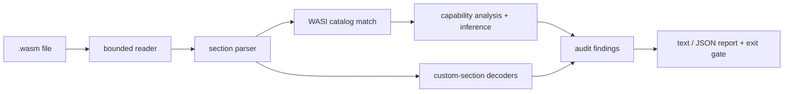

# wasmscout

[English](README.md) | [中文](README.zh.md) | [日本語](README.ja.md)

[](LICENSE) [](Cargo.toml) [](CHANGELOG.md)  [](CONTRIBUTING.md)

**wasmscout：开源的 WebAssembly 二进制能力审计器——imports、WASI 能力、自定义段与体积，让你在运行之前就知道这个模块能碰到什么。**


```bash
git clone https://github.com/JaydenCJ/wasmscout.git && cargo install --path wasmscout
```

> 预发布：v0.1.0 尚未上架 crates.io；请按上述方式从源码构建（任意 Rust ≥1.75，零依赖）。

## 为什么选 wasmscout？

如今第三方代码正是通过 wasm 插件进入 agent、代理、数据库和边缘平台的——而你即将加载的模块，只是别人递来的一个不透明二进制。现有工具只会*描述*它：`wasm-objdump` 和 `wasm-tools print` 忠实地转储每个段，`twiggy` 分析体积，但没有一个回答运维者真正的问题——*这东西能写文件吗？能开 socket 吗？能读我的环境变量吗？*——也没有一个给出能接进准入流水线的通过/失败信号。wasmscout 是审计器而不是转储器：它零依赖、零执行地解析二进制，把每个函数 import 经由完整的 46 函数 WASI preview 1 目录（外加 preview 2 接口前缀和自定义宿主模块）映射到 11 个按风险分级的能力组，解码携带来源信息和泄漏的自定义段，并把结果变成带严重级别的稳定 finding id、JSON 报告和退出码。它甚至能抓住 import 列表藏起来的组合：`path_open` + `fd_write` 就是文件写能力，根本不需要 `path_unlink`。

|  | wasmscout | wasm-objdump (wabt) | wasm-tools print | twiggy |
|---|---|---|---|---|
| 裁决而不只是打印 | ✅ 能力组 + findings | ❌ 转储段 | ❌ 转储文本格式 | ❌ 分析体积 |
| WASI import → 能力映射 | ✅ 全部 46 个 preview 1 + preview 2 前缀 | ❌ | ❌ | ❌ |
| 组合推断（`path_open`+`fd_write`） | ✅ 标注 `[inferred]` | ❌ | ❌ | ❌ |
| CI 门禁：严重级别、拒绝清单、退出码 | ✅ `--fail-on` / `--deny` / `--ignore` | ❌ | ❌ | ❌ |
| 诊断截断/冒充文件 | ✅ 字节偏移，HTML/ELF/wat 嗅探 | 部分 | 部分 | ❌ |
| 调试膨胀与 source-map 泄漏检查 | ✅ 大小、百分比、泄漏的 URL | ❌ | ❌ | 部分 |
| 运行时依赖 | 0——单个静态二进制 | C++ 工具链 | Rust crate 栈 | Rust crate 栈 |

## 特性

- **"这个模块能碰到什么？"只需一条命令**——每个函数 import 都映射到 11 个能力组之一（`fs-write`、`network`、`host`、`fs-read`、`environment`……），按风险排序，逐条列出是哪些 import 授予了它。
- **理解组合**——`path_open` 的权限是在调用时决定的，所以 `path_open` + `fd_write` 会被报告为 `fs-write` 并标注 `[inferred]`，理由写在消息里；单看 import 列表根本发现不了。
- **诚实的分类**——单独的 `fd_write` 是 stdio（`fd-io`，低风险），不是"文件系统写"；危言耸听的报告只会让人学会忽略它，所以低风险能力出现在表格里但不产生 finding。
- **自定义段被解码而不是跳过**——来自 `producers` 的工具链出处、以文件占比呈现的调试膨胀、`sourceMappingURL` 泄漏的 URL、逃过链接器的 `linking`/`reloc.*` 目标文件、`dylink` 的加载器期待。
- **是 CI 门禁而不只是报告**——17 个带严重级别的稳定 finding id、`--fail-on high|medium|low|info|never`、按能力存在性判定的 `--deny network,fs-write`、按 finding id 的 `--ignore`、退出码 `0`/`1`/`2`、JSON Lines 输出。
- **零依赖、零联网、零执行**——纯 `std` Rust，单个静态二进制；读本地文件、写 stdout，绝不运行模块的任何一个字节。
- **扛得住恶意输入**——截断带字节偏移报告、不可能的向量计数被拒绝、超长 LEB128 被拒绝、HTML/ELF/gzip/`.wat` 冒充者被点名识别；post-MVP 内容（GC 类型、未知段）优雅降级而不是崩溃。

## 快速上手

安装（需要 Rust 1.75+）：

```bash
git clone https://github.com/JaydenCJ/wasmscout.git && cargo install --path wasmscout
```

用仓库内置的确定性 writer 生成演示 fixtures，然后审计那个 import 列表看起来人畜无害的模块：

```bash
cd wasmscout && cargo run --example gen_fixtures -- /tmp/wasm-fixtures
cd /tmp/wasm-fixtures && wasmscout scan sneaky-logger.wasm
```

输出（原样捕获）：

```text
sneaky-logger.wasm: core wasm module · 187 B · 5 section(s) · 4 import(s) · 1 export(s)
  target: WASI preview 1 (wasi_snapshot_preview1)

capabilities
  fs-write     high    path_open, fd_write [inferred]
  fs-read      medium  path_open
  fd-io        low     fd_write, fd_close
  clocks       low     clock_time_get

findings
  high[wasi.fs-write]: file-write capability inferred from path_open, fd_write: path_open chooses rights at call time; combined with fd_write the module can write any file it can open
  medium[wasi.fs-read]: imports 1 file-reading WASI function(s) (path_open) — the module can open and read everything under the runtime's preopens

summary: 1 module(s) scanned — 1 high, 1 medium, 0 low, 0 info · gate: fail-on high → FAIL
```

退出码是 1，准入流水线在这里就把模块拒之门外。纯计算模块则连最严格的策略都能通过：

```bash
wasmscout scan --fail-on info --deny network,fs-write image-filter.wasm
```

```text
image-filter.wasm: core wasm module · 201 B · 8 section(s) · 0 import(s) · 2 export(s)
  module name: "image_filter"
  producers: language Rust 1.75.0 · processed-by rustc 1.75.0, wasm-opt 116
  target: no function imports (pure compute module)

capabilities
  (none — the module cannot touch the host at all)

findings
  (none)

summary: 1 module(s) scanned — 0 high, 0 medium, 0 low, 0 info · gate: fail-on info → PASS
```

`wasmscout caps *.wasm` 为批量巡检输出每模块一行、按风险排序的清单；`imports`、`exports` 和 `sections` 展示签名、limits 和体积分解；`--format json` 为每个模块输出一个机器可读对象。`examples/ci-gate.sh` 是一个完整的插件准入门禁。

## 能力与风险

十一个能力组，按风险分级；完整映射（全部 46 个 preview 1 函数、preview 2 接口前缀、推断规则、每个 finding id）见 [docs/capabilities.md](docs/capabilities.md)。

| 能力 | 风险 | 授予 |
|---|---|---|
| `fs-write` | high | 在运行时的 preopens 之下创建、修改或删除文件 |
| `network` | high | 通过宿主提供的 socket 接受、发送或接收 |
| `host` | medium | 自定义宿主函数——威力完全取决于嵌入方 |
| `fs-read` | medium | 打开路径、读取文件和目录列表 |
| `environment` | medium | 读取宿主环境变量 |
| `fd-io` / `args` / `clocks` / `random` / `process` / `scheduling` | low | stdio、argv、时钟、随机数、退出、poll |

## CLI 选项

| Key | 默认值 | 作用 |
|---|---|---|
| `--format` | `text` | `json` 为每个模块输出一个对象（JSON Lines），含能力、findings 和 `pass` |
| `--fail-on` | `high` | 在该严重级别及以上退出 1：`high`、`medium`、`low`、`info` 或 `never` |
| `--deny` | 无 | 逗号分隔的能力清单，只要存在即强制退出 1，对照目录校验 |
| `--ignore` | 无 | 逗号分隔的要抑制的 finding id，对照目录校验 |

退出码：`0` = 通过门禁，`1` = 有被门禁的 finding 或被拒绝的能力，`2` = 用法错误、不可读/畸形输入，或 component-model 二进制（能识别，尚未审计）。

## 验证

本仓库不带 CI；上述每一条主张都由本地运行验证：`cargo test`（77 个单元测试 + 13 个 CLI 集成测试）和 `bash scripts/smoke.sh`——它生成真实的 wasm fixtures 并端到端驱动二进制，必须打印 `SMOKE OK`。

## 架构



## 路线图

- [x] 核心审计器：带恶意输入防护的纯 std 二进制解析器、46 函数 WASI preview 1 目录 + preview 2 前缀、能力推断、17 个 finding id、JSON 输出、deny/fail-on/ignore CI 门禁、确定性 fixture writer、90 个测试 + smoke 脚本
- [ ] Component-model（layer 1）审计：world 与导入的接口
- [ ] 签名一致性：对照规范类型检查 preview 1 imports
- [ ] `wasmscout pin`：把模块的能力集冻结成锁文件，更新扩权时让 CI 失败
- [ ] 调用图可达性：哪些 export 真正能触达哪个能力
- [ ] 面向代码扫描 UI 的 SARIF 输出

完整列表见 [open issues](https://github.com/JaydenCJ/wasmscout/issues)。

## 贡献

欢迎贡献——见 [CONTRIBUTING.md](CONTRIBUTING.md)，从一个 [good first issue](https://github.com/JaydenCJ/wasmscout/issues?q=is%3Aissue+is%3Aopen+label%3A%22good+first+issue%22) 开始，或发起一个 [discussion](https://github.com/JaydenCJ/wasmscout/discussions)。

## 许可证

[MIT](LICENSE)
